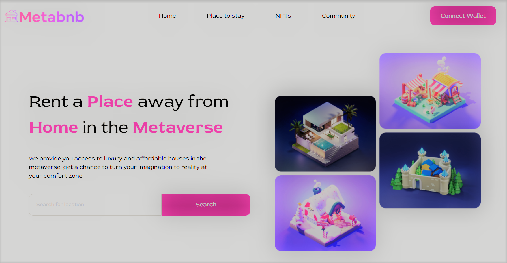

<div align="center">
	<h1> Metabnb- Rent A Place Away From Home In The Metaverse.</h1>
</div>

## Snapshots 📸



## Tech Stack 

- [React.js]- UI Library
- [Tailwind CSS]- Styling and UI


## How to run locally 💻

## Project-Setup-Instructions
1)Installation of the Visual studio code .

2)Git cloning the repository .

3)install the app dependancies by running npm install

4)After the node-modules packages and other dependancies have been installed run npm start or npm run start to run the app/ yarn start

Now, you can navigate to http://localhost:3000/ to view the app.

### Build

```bash
npm run build
```
 ### License
 Copyright (c) [2022] [Jackson Otieno] Permission is hereby granted, free of charge, to any person obtaining a copy of this software and associated documentation files (the "Software"), to deal in the Software without restriction, including without limitation the rights to use, copy, modify, merge, publish, distribute, sublicense, and/or sell copies of the Software, and to permit persons to whom the Software is furnished to do so, subject to the following conditions:

The above copyright notice and this permission notice shall be included in all copies or substantial portions of the Software.

THE SOFTWARE IS PROVIDED "AS IS", WITHOUT WARRANTY OF ANY KIND, EXPRESS OR IMPLIED, INCLUDING BUT NOT LIMITED TO THE WARRANTIES OF MERCHANTABILITY, FITNESS FOR A PARTICULAR PURPOSE AND NONINFRINGEMENT. IN NO EVENT SHALL THE AUTHORS OR COPYRIGHT HOLDERS BE LIABLE FOR ANY CLAIM, DAMAGES OR OTHER LIABILITY, WHETHER IN AN ACTION OF CONTRACT, TORT OR OTHERWISE, ARISING FROM, OUT OF OR IN CONNECTION WITH THE SOFTWARE OR THE USE OR OTHER DEALINGS IN THE SOFTWARE.

Author
By Jackson otieno.

Support-And-Contact-Details
Email address: jacksonohallo@gmail.com Slack:jaseric